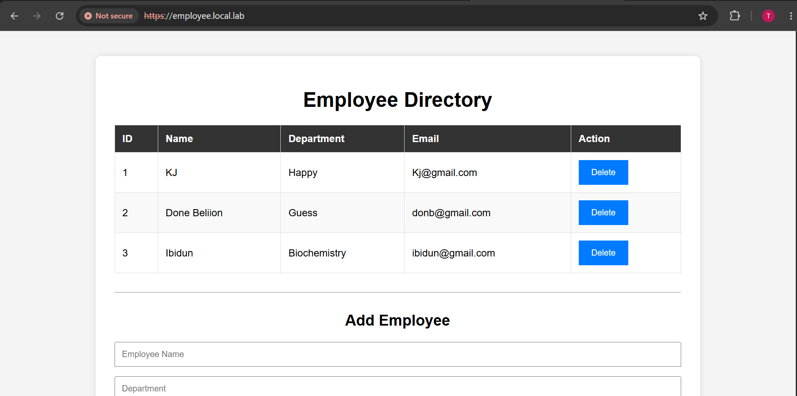
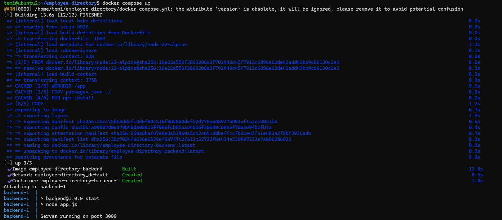
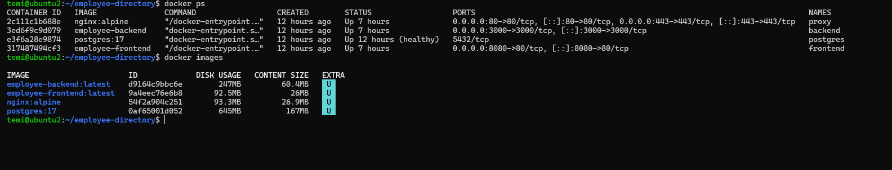

# Employee Directory - Docker Compose

A simple Employee Directory application built as part of my DevOps learning journey.

The project demonstrates how a modern web application is deployed using Docker, Docker Compose, PostgreSQL, Nginx Reverse Proxy, and a Node.js backend.


<p align="center">
  
</p>

## Architecture

Windows Client  
↓  
pfSense DNS  
↓  
Nginx Reverse Proxy  
↓  
Docker Network  
├── Frontend  
├── Backend (Express)  
└── PostgreSQL  

---

## Tech Stack

- Node.js
- Express
- PostgreSQL
- Docker
- Docker Compose

<p align="center">
  

- Nginx

## Features

- View Employees
- Add Employee
- Delete Employee
- PostgreSQL Database
- Persistent Docker Volume
- Reverse Proxy
- Docker Networking
- Health Checks

---

## Project Structure

backend/

database/

frontend/

nginx/

docs/

screenshots/

docker-compose.yml

---
## Challenges Faced

- Docker container networking and service discovery
- Reverse proxy configuration with Nginx
- Database persistence using Docker volumes
- PostgreSQL connection troubleshooting
- CORS configuration
- Container startup dependencies
- Docker Compose health checks
- Integrating the application with an existing pfSense/Nginx lab

### Docker containers & Images
<p align="center">
  


## Quick Start 

```bash
* Clone the repository

* cd employee-directory

* cp .env.example .env

# Edit .env with your own values

* docker compose up --build -d

* Visit

http://localhost

* Verify

http://localhost:3000/health