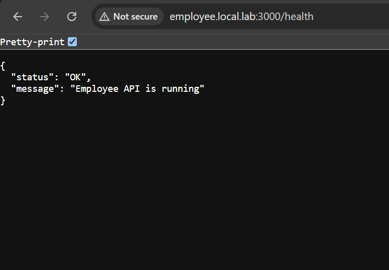

# Employee Directory — Backend

Express REST API for the Employee Directory application.

## Tech Stack

- **Node.js** + **Express**
- **PostgreSQL** (via `pg`)
- **Docker** / **Docker Compose**
- **nginx** (reverse proxy + SSL termination)

## Endpoints

| Method | Endpoint          | Description                  |
|--------|-------------------|-------------------------------|
| GET    | `/health`         | Health check                 |
| GET    | `/employees`      | Get all employees            |
| POST   | `/employees`      | Create a new employee        |
| DELETE | `/employees/:id`  | Delete an employee by ID     |

## Getting Started

### 1. Install dependencies

```bash
npm install
```

### 2. Configure environment variables

Create a `.env` file in the project root:

```env
PORT=3000
DB_USER=postgres
DB_PASSWORD=postgres
DB_NAME=employee_directory
DB_HOST=localhost
DB_PORT=5432
```

### 3. Run in development mode

```bash
npm run dev
```

### 4. Run in production mode

```bash
npm start
```

The server will start on `http://localhost:3000` (or the port set in `.env`).

## Example Requests

**Health check**
```bash
curl localhost:3000/health
```
---
<p align="center">
  
</p>

---
## Structure

```
backend/
├── app.js
├── Dockerfile
├── controllers/
│   └── employeeController.js
├── routes/
│   └── employees.js
├── db/
│   └── db.js
├── package.json
├── README.md
└── .env
```
